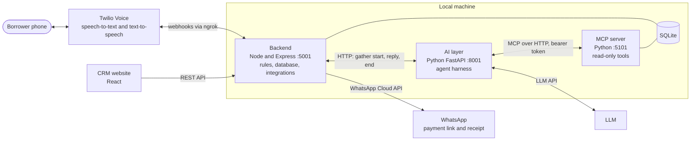
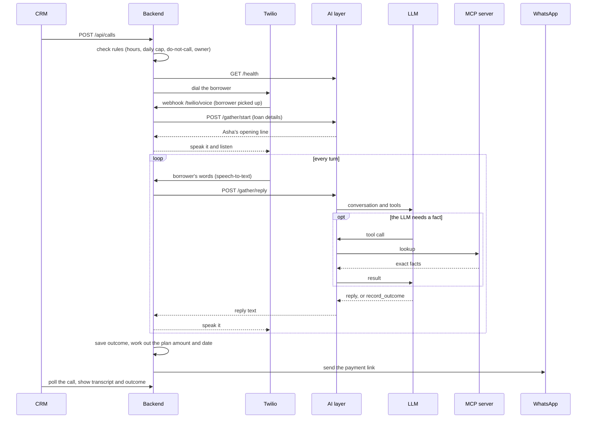
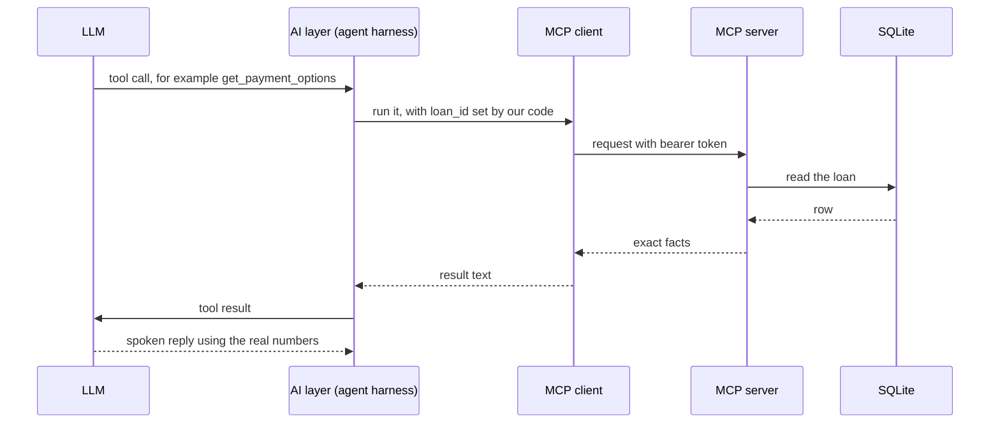

# Asha: EMI Collection Voice Agent

**Asha is a voice AI agent that phones borrowers with an overdue EMI, offers one of three approved payment plans, and sends a WhatsApp payment link. A CRM website lets a collections team claim borrowers, start calls and read every transcript.**

I built this project with my teammates Prashanth, Karthik and Bindu. This README explains what I built, the tech stack, how a call flows through the system, and how MCP is used to ground the LLM in real data.

## Contents

- [What Asha does](#what-asha-does)
- [Tech stack](#tech-stack)
- [Architecture](#architecture)
- [The pipeline: one call from start to end](#the-pipeline-one-call-from-start-to-end)
- [How MCP works in this project](#how-mcp-works-in-this-project)
- [Guardrails](#guardrails)
- [Run it locally](#run-it-locally)
- [Honest limits](#honest-limits)
- [Next steps](#next-steps)

## What Asha does

1. A collections agent claims borrowers in the CRM and presses **Call**, or **Automate calls** to work through a queue one borrower at a time.
2. The backend checks the calling rules, and Twilio dials the borrower.
3. Asha talks turn by turn. She checks she has the right person, finds out why the payment is late, and offers a plan.
4. When the borrower agrees, the call ends with a structured result: the situation, the agreed plan and the promise date.
5. A payment link is sent on WhatsApp. The CRM shows the transcript, the outcome and the payment status.
6. Disputes ("I already paid") and wrong numbers are never argued with. They are recorded and handed to a person.

The three plans Asha may offer are: pay in full today, pay in full within 5 days, or pay half today and half within 15 days. She cannot offer anything else.

## Tech stack

| Layer | Technology | Role |
|---|---|---|
| CRM website | React, Vite, TypeScript | Dashboard, borrowers, calls, payments, messages, transcripts |
| Backend | Node.js, Express, SQLite | The gateway: rules, database, Twilio and WhatsApp integration |
| AI layer | Python, FastAPI | The agent harness around the LLM |
| LLM | An Anthropic LLM (Haiku by default, set by `ANTHROPIC_MODEL`) | Writes Asha's replies and decides when to look something up |
| Grounding | MCP server (Python, Model Context Protocol) | Read-only lookups of loan facts |
| Telephony | Twilio Voice | Dials the call, speech-to-text, text-to-speech |
| Messaging | WhatsApp Cloud API (Meta) | Sends payment links and receipts |
| Tunnel | ngrok | Lets Twilio and WhatsApp reach a local backend |
| Testing | `chat.py` terminal script, Postman, real calls | Manual testing of the agent, the API and the full flow |

## Architecture



| Folder | What it is |
|---|---|
| `frontend-layer` | The CRM website |
| `backend-layer` | The gateway. It enforces policy before any call and talks to Twilio, WhatsApp and the database |
| `ai-layer` | The agent harness: system prompt, conversation loop, tool calling and output validation |
| `mcp-server` | A read-only MCP server that gives the LLM exact loan facts |

**Why two separate back-end services?** The backend owns the rules and the integrations, so a policy such as calling hours is checked before the AI layer is ever asked. The AI layer only decides what Asha says. Each can change without touching the other.

## The pipeline: one call from start to end



In words:

1. **Start.** The CRM sends `POST /api/calls`. The backend checks the agent is logged in and owns the borrower, checks the calling rules, confirms the AI layer is running, saves a call record, and asks Twilio to dial.
2. **Pick-up.** Twilio calls the backend webhook. The backend sends the loan details to the AI layer (`/gather/start`) and gets back Asha's opening line, which Twilio speaks.
3. **The turn loop.** Twilio turns the borrower's speech into text and posts it to the backend. The backend forwards it to the AI layer (`/gather/reply`). The AI layer asks the LLM, which may look up facts through MCP, and returns the reply for Twilio to speak. This repeats every turn. It is turn-based listen-and-reply, not live audio streaming.
4. **End.** The LLM ends the call with a `record_outcome` tool call. The AI layer validates it. The backend saves the outcome and works out the amount and date from its own rules.
5. **Follow-up.** The backend creates a payment link and sends it on WhatsApp. If the borrower hangs up early, Twilio's status callback closes the call anyway. When a payment is marked paid, the loan balance updates and a receipt is sent.

## How MCP works in this project

**MCP (Model Context Protocol)** is a standard way for an LLM application to ask a separate server for tools and data. I use it so that Asha's LLM looks up real facts instead of guessing them.

### Why I added it

Before MCP, loan details were pasted into the prompt. That data could be stale or incomplete, and the model had no way to check it. With MCP, the LLM asks for exactly the fact it needs at the moment it needs it, and the answer comes straight from the database. This is called **grounding**.

### The two pieces

- **MCP server** (`mcp-server`, Python). It reads the database and exposes a few tools over HTTP at `/mcp`. It is stateless: every request stands alone, so a restart never leaves a client holding a dead session.
- **MCP client** (`ai-layer/mcp_client.py`). It keeps one connection to the server for the AI layer, tells the LLM which tools exist, and runs the tool calls the LLM asks for.

### The tools

| Tool | Returns |
|---|---|
| `get_loan` | Borrower name, amount due, due date, days overdue, status, calls made today, and whether calling is allowed right now |
| `get_payment_options` | The three plans with the exact rupee amounts and dates, already worked out by the rules |
| `get_call_history` | Earlier calls: the situation, the plan agreed and any promise. The transcript is only returned if asked for |
| `list_overdue_loans` | Overdue loans for the team. It is not given to the LLM during a call |

All tools are marked read-only. Nothing the LLM does through MCP can change data.

### What happens on one lookup



### Safety rules around MCP

- **The LLM cannot pick the borrower.** `loan_id` is hidden from the tool schema the LLM sees, and the AI layer always fills it in with the current call's loan. The LLM can only ever look up the person on the line.
- **Read-only tools.** There is no tool that writes.
- **Bearer token.** The server rejects any request without the right token (compared in constant time) and returns 401. It also rejects any request carrying a browser `Origin` header, and it listens on `127.0.0.1` only.
- **No phone numbers.** The loan view returned to the LLM never includes the borrower's phone number.
- **At most two lookups per reply.** On the last round the lookup tools are withdrawn, so a reply always ends in speech and the caller is never left in silence.
- **Failures never crash a call.** A failed lookup goes back to the LLM as an error result. If the MCP server is down or switched off, the call runs without lookups.
- **Lookups are not saved.** Tool results are added to a copy of the conversation for that turn only, so the stored history stays plain text and the context window stays small.

### Why MCP and not RAG

The data here is exact, structured loan data. A lookup by id returns the precise row, while similarity search returns text that is merely close, which is the wrong tool when a rupee amount must be exactly right. RAG would make sense if I added long policy documents to search.

## Guardrails

Important rules live in code, because a prompt alone can be ignored by a model.

| Guardrail | Where it lives |
|---|---|
| Polite tone, short replies, never threaten, never invent plans | The system prompt |
| Only the three approved plans | Plan amounts and dates are computed by backend rules, not by the LLM |
| Valid final result | `record_outcome` is validated against allowed values, and anything invalid becomes a safe default |
| Calling hours (9 AM to 6 PM IST), at most two calls per loan per day, no calls to paid, promised, disputed or wrong-number loans | The backend, checked before every call |
| One owner per borrower | The backend: a borrower is claimed by one agent before anyone can call them |
| Disputes and wrong numbers | Recorded and escalated to a person, never argued |
| Webhook authenticity | Twilio's signature is checked on every webhook |

## Run it locally

You need Node 20+, Python 3.12+, and an Anthropic API key. Twilio and WhatsApp are optional: without them the app runs with phone calls and WhatsApp off.

1. **Create your env files** by copying each example and filling it in:
   - `backend-layer/.env.example` to `backend-layer/.env`
   - `ai-layer/.env.example` to `ai-layer/.env`
   - `mcp-server/.env.example` to `mcp-server/.env`

   `MCP_TOKEN` must be the same long random string in `ai-layer/.env` and `mcp-server/.env`. Make one with:
   ```bash
   python -c "import secrets; print(secrets.token_urlsafe(32))"
   ```
2. **Install and start each part** (four terminals):
   ```bash
   cd mcp-server && pip install -r requirements.txt && python server.py
   cd ai-layer && pip install -r requirements.txt && python app.py
   cd backend-layer && npm install && npm start
   cd frontend-layer && npm install && npm run build
   ```
3. Open **http://localhost:5001** and register an account. For frontend development, run `npm run dev` in `frontend-layer` and open http://localhost:3001.
4. **Test the agent without a phone:** `cd ai-layer && python chat.py` lets you type as the borrower.

For real phone calls you also need a Twilio account (a trial account works for verified numbers) and a public tunnel, for example `ngrok http 5001`. Put the tunnel address in `PUBLIC_BASE_URL`.

Optional: `frontend-layer/.env.local.example` shows how to enable a Shift+R developer-login shortcut.

## Honest limits

- Built and tested on a Twilio trial account and Meta's WhatsApp test number, so only verified and allowed numbers work.
- Payments are a mock page, not a real gateway.
- Testing so far is manual (a terminal test script, Postman, and real calls). There is no automated evaluation suite yet, so no accuracy numbers are claimed.
- No savings or cost figures have been measured. That would need a pilot on real accounts.
- This is a demo, not a production system. Sessions are kept in memory, there is no rate limiting, and sign-up is open. Do not expose it to the internet as it is.

## Next steps

An automated evaluation harness with scripted borrower scenarios, a real payment gateway, a link to a lender's own loan system, automatic retries, and reporting.
